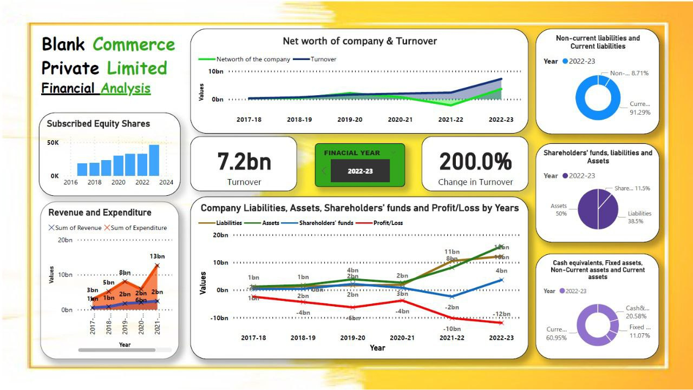

# Blank Financial Analysis Dashboard

This repository contains a financial analysis dashboard for **Blank Commerce Private Limited**, showcasing the company's financial performance and key metrics for the fiscal year 2022-23. The dashboard provides visual insights into the company's net worth, turnover, liabilities, assets, revenue, and expenditures.

## Dashboard Overview

### Features:

1. **Net Worth and Turnover**
   - **Net worth and turnover trends** are depicted from 2017-18 to 2022-23.
   - The company achieved a **7.2bn turnover** in 2022-23, with a **200% growth** in turnover compared to previous years.

2. **Subscribed Equity Shares**
   - Bar chart displaying growth in equity shares from 2016 to 2024.
   - Significant rise in subscribed equity shares over time.

3. **Revenue and Expenditure**
   - Line graph comparing revenue and expenditure trends from 2017 to 2023.
   - Revenue peaked at **13bn** in 2022-23, indicating strong financial performance.

4. **Liabilities, Assets, and Shareholders' Funds**
   - Trend analysis of:
     - Liabilities
     - Assets
     - Shareholders' funds
     - Profit/Loss
   - Displays financial dynamics over six years (2017-2023).

5. **Breakdown of Non-Current and Current Liabilities**
   - **Non-current liabilities:** 8.71%
   - **Current liabilities:** 91.29%

6. **Shareholders' Funds, Liabilities, and Assets**
   - Pie chart breakdown:
     - **Assets:** 50%
     - **Liabilities:** 38.5%
     - **Shareholders' equity:** 11.5%

7. **Cash Equivalents, Fixed Assets, and Other Components**
   - Proportion of financial components in 2022-23:
     - **Cash and equivalents:** 60.95%
     - **Fixed assets:** 11.07%
     - **Non-current assets:** 20.58%
     - **Current assets:** remaining percentage.

---

## File Details

### Files Included:
- **Dashboard Image:**  
   – A comprehensive visualization of financial data.

---

